# Diagrams-as-Code


### [View all Roadmaps](https://github.com/nholuongut/all-roadmaps) &nbsp;&middot;&nbsp; [Best Practices](https://github.com/nholuongut/all-roadmaps/blob/main/public/best-practices/) &nbsp;&middot;&nbsp; [Questions](https://www.linkedin.com/in/nholuong/)
<br/>

Diagrams shown below are automatically (re)generated by GitHub Actions CI/CD 😎

I read an article that said:
> the ability to create meaningful diagrams is the pinnacle of communication skills as an engineer

<!-- INDEX_START -->

- [Documentation](#documentation)
- [Diagrams](#diagrams)
  - [This Repo's Creation & GitHub Actions CI/CD to auto-(re)generate diagrams from code changes](#this-repos-creation--github-actions-cicd-to-auto-regenerate-diagrams-from-code-changes)
  - [GitHub Flow with Jira ticket integration](#github-flow-with-jira-ticket-integration)
  - [Git - why you shouldn't use long-lived feature branches](#git---why-you-shouldnt-use-long-lived-feature-branches)
  - [AWS Web Traffic Classic](#aws-web-traffic-classic)
  - [Azure Active Directory Single Sign-On](#azure-active-directory-single-sign-on)
  - [Jenkins CI/CD on Kubernetes](#jenkins-cicd-on-kubernetes)
  - [ArgoCD - GitOps for Kubernetes](#argocd---gitops-for-kubernetes)
  - [GCP Cloudflare Web Architecture GKE](#gcp-cloudflare-web-architecture-gke)
  - [GCP Malware Scanner with ClamAV](#gcp-malware-scanner-with-clamav)
  - [Kubernetes Deployment with Horizontal Pod Autoscaler and Ingress](#kubernetes-deployment-with-horizontal-pod-autoscaler-and-ingress)
  - [Kubernetes Stateful Architecture with persistent volumes](#kubernetes-stateful-architecture-with-persistent-volumes)
  - [Kubernetes Service External Traffic Policy](#kubernetes-service-external-traffic-policy)
  - [Kubernetes on Premise](#kubernetes-on-premise)
  - [Traefik Kubernetes Ingress on GKE](#traefik-kubernetes-ingress-on-gke)
  - [Kong API Gateway on Kubernetes (AWS EKS)](#kong-api-gateway-on-kubernetes-aws-eks)
  - [OpenTSDB on Kubernetes and HBase](#opentsdb-on-kubernetes-and-hbase)
  - [MySQL Replica Architecture](#mysql-replica-architecture)
  - [Kafka Pub/Sub](#kafka-pubsub)
  - [Elasticsearch Queries](#elasticsearch-queries)
  - [Kafka Flink Elasticsearch](#kafka-flink-elasticsearch)
  - [Cassandra Queries](#cassandra-queries)
  - [Prometheus & Thanos](#prometheus--thanos)
  - [RabbitMQ Pub/Sub](#rabbitmq-pubsub)
  - [Apigee Akamai EKS](#apigee-akamai-eks)
  - [Devs Test in Production](#devs-test-in-production)
  - [Code, Commit, Push, Boom](#code-commit-push-boom)
  - [The Danger of Testing Ideas in Production](#the-danger-of-testing-ideas-in-production)
  - [Git - Environment Branches](#git---environment-branches)
  - [LucidChart - GCP Architecture](#lucidchart---gcp-architecture)
  - [Web Basics](#web-basics)
  - [Network - Layer 2 - Local - ARP](#network---layer-2---local---arp)
  - [Network - Layer 3 - Remote - IP](#network---layer-3---remote---ip)
- [Gantt Chart of my Experience](#gantt-chart-of-my-experience)
- [Gantt Chart of my GitHub Repos](#gantt-chart-of-my-github-repos)
- [Git Commits per Month for this Repo](#git-commits-per-month-for-this-repo)
  - [GNUplot - Commits per Month](#gnuplot---commits-per-month)
  - [MermaidJS - Commits per Month](#mermaidjs---commits-per-month)
- [Git Commit Times across my Repos](#git-commit-times-across-my-repos)
  - [GNUplot - Commit Times](#gnuplot---commit-times)
  - [MermaidJS - Commit Times](#mermaidjs---commit-times)
  - [Golang GoNum - Commit Times](#golang-gonum---commit-times)
- [Samples Revamped](#samples-revamped)
  - [AWS Load Balanced Web Farm](#aws-load-balanced-web-farm)
  - [AWS Clustered Web Services](#aws-clustered-web-services)
  - [Advanced Web Services Open Source](#advanced-web-services-open-source)
  - [GCP Pub/Sub Analytics](#gcp-pubsub-analytics)
  - [AWS Event Processing](#aws-event-processing)
  - [AWS Serverless Image Processing](#aws-serverless-image-processing)
- [Build from Source](#build-from-source)
- [Templates](#templates)
- [Star History](#star-history)
- [More Core Repos](#more-core-repos)
  - [Knowledge](#knowledge)
  - [DevOps Code](#devops-code)
  - [Containerization](#containerization)
  - [CI/CD](#cicd)
  - [DBA - SQL](#dba---sql)
  - [DevOps Reloaded](#devops-reloaded)
  - [Templates](#templates)
  - [Misc](#misc)

<!-- INDEX_END -->

## Documentation

[Gist](https://gist.github.com/nholuongut/cb53b7622791718f1ee9d8709c9eec35)
from [Knowledge-Base](https://github.com/nholuongut/knowledge-base/blob/main/diagrams.md)
repo full of links to Diagrams technologies and
[Icon Sets](https://github.com/nholuongut/knowledge-base/blob/main/diagrams.md#important-icon-sets-to-import-into-d2).

## Diagrams

They say a picture is worth a thousand words...

### This Repo's Creation & GitHub Actions CI/CD to auto-(re)generate diagrams from code changes

[github_actions_cicd.py](github_actions_cicd.py):

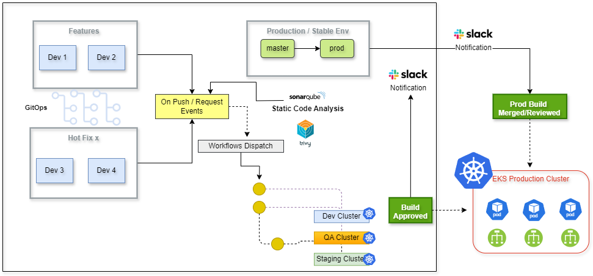

Open [README.md](https://github.com/nholuongut/diagrams-as-code/blob/master/README.md#this-repos-creation--github-actions-cicd-to-auto-regenerate-diagrams-from-code-changes) to enlarge:

[github_actions_cicd.d2](github_actions_cicd.d2):

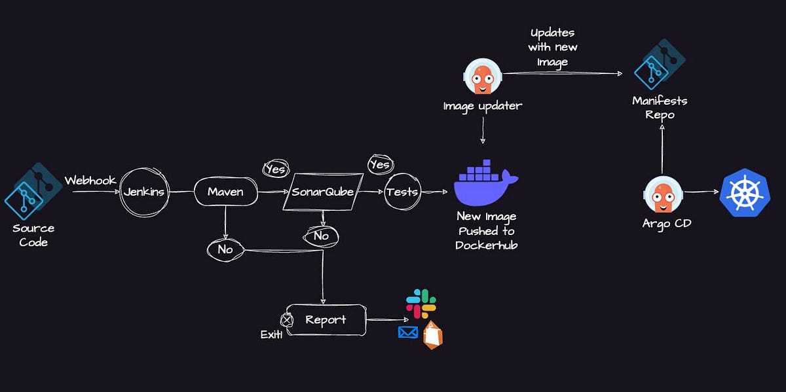

### GitHub Flow with Jira ticket integration

Prefix Git branches with Jira ticket numbers in Jira's `AA-NNN` format for GitHub Pull Requests to automatically appear in Jira tickets (see this [doc](https://support.atlassian.com/jira-cloud-administration/docs/integrate-with-github/)):

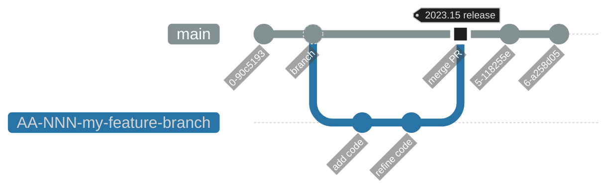
```mermaid
%% https://mermaid.js.org/syntax/gitgraph.html#gitgraph-specific-configuration-options
%% https://htmlcolorcodes.com/
%%{ init: {
        "logLevel": "debug",
        "theme": "dark",
        "themeVariables": {
            "git0": "#839192",
            "git1": "#2874A6",
            "gitInv0": "#FFFFFF",
            "gitBranchLabel0": "#FFFFFF",
            "commitLabelColor": "#FFFFFF"
        }
    }
}%%
gitGraph
    commit
    commit id: "branch"
    branch AA-NNN-my-feature-branch
    checkout AA-NNN-my-feature-branch
    commit id: "add code"
    commit id: "refine code"
    checkout main
    merge AA-NNN-my-feature-branch id: "merge PR" type: HIGHLIGHT tag: "2023.15 release"
    commit
    commit
```

### Git - why you shouldn't use long-lived feature branches

\* [Environment Branches](https://github.com/nholuongut/diagrams-as-code/blob/master/README.md#git---environment-branches) may be one of the few exceptions but requires workflow discipline.

See Also: 100+ scripts for Git and the major Git repo providers like GitHub, GitLab, Bitbucket, Azure DevOps in my [DevOps-Bash-tools](https://github.com/nholuongut/devops-bash-tools) repo.

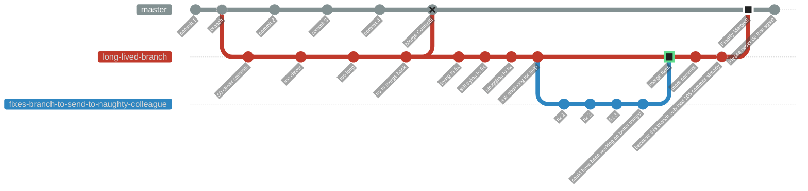
```mermaid
%% https://mermaid.js.org/syntax/gitgraph.html#gitgraph-specific-configuration-options
%% https://htmlcolorcodes.com/
%%{ init: {
        "logLevel": "debug",
        "theme": "dark",
        "gitGraph": {
            "mainBranchName": "master"
        },
        "themeVariables": {
            "git0": "#839192",
            "git1": "#C0392B ",
            "git2": "#2E86C1",
            "gitInv0": "#FFFFFF",
            "gitBranchLabel0": "#FFFFFF",
            "commitLabelColor": "#FFFFFF"
        }
    }
}%%
gitGraph
    commit  id: "commit 1"
    commit id: "branch"
    branch long-lived-branch
    checkout long-lived-branch
    commit id: "50 clever commits"
    checkout master
    commit id: "commit 2"
    checkout long-lived-branch
    commit id: "too clever"
    checkout master
    commit id: "commit 3"
    checkout long-lived-branch
    commit id: "too long"
    checkout master
    commit id: "commit 4"
    checkout long-lived-branch
    commit id: "try to merge back"
    checkout master
    merge long-lived-branch id: "Merge Conflict!!" type: REVERSE
    checkout long-lived-branch
    commit id: "trying to fix"
    commit id: "still trying to fix"
    commit id: "struggling to fix"
    commit id: "ask nholuong for help"
    branch fixes-branch-to-send-to-naughty-colleague
    checkout fixes-branch-to-send-to-naughty-colleague
    commit id: "fix 1"
    commit id: "fix 2"
    commit id: "fix 3"
    commit id: "could have been working on better things!"
    checkout long-lived-branch
    merge fixes-branch-to-send-to-naughty-colleague id: "merge fixes" type: HIGHLIGHT
    commit id: "more commits"
    commit id: "because this branch only had 105 commits already"
    checkout master
    merge long-lived-branch id: "Finallly Merged!" type: HIGHLIGHT
    commit id: "Please never do that again"
```

### AWS Web Traffic Classic

[aws_web_traffic_classic.py](aws_web_traffic_classic.py):

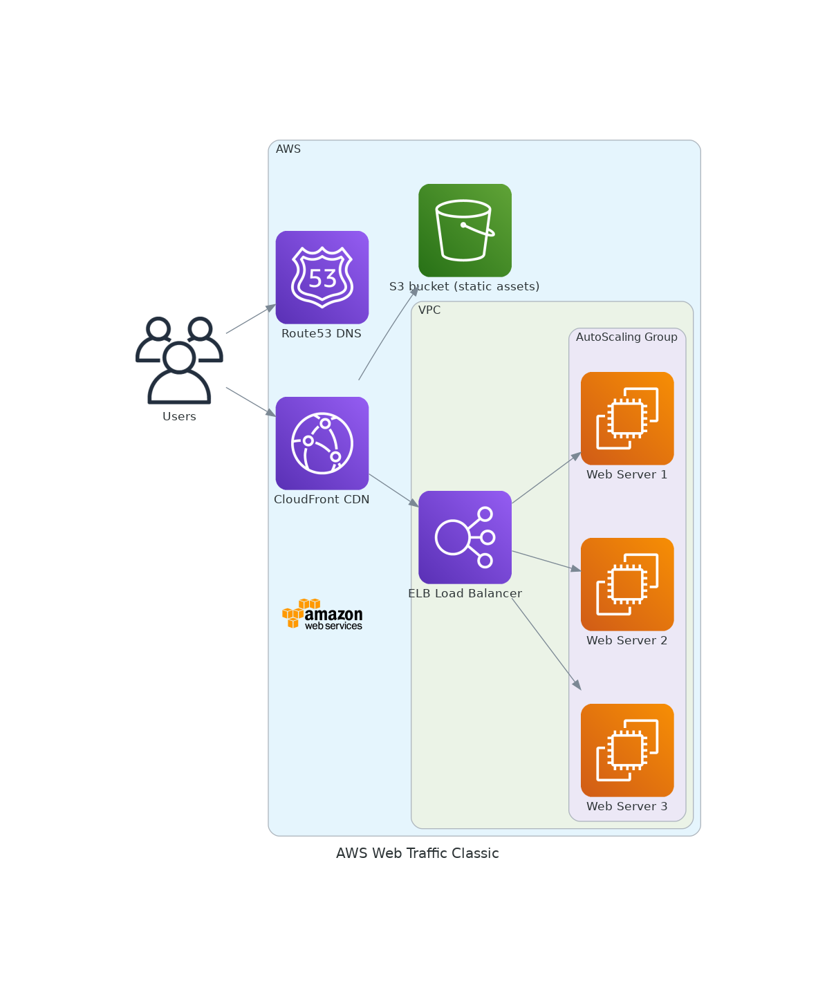

### Azure Active Directory Single Sign-On

I've administered [Azure Active Directory](https://azure.microsoft.com/en-us/products/active-directory) at a couple of companies and integrated a variety of applications including GitHub Enterprise Cloud, AWS IAM Identity Center (formerly AWS SSO), Jenkins, ArgoCD, Keycloak, Hubspot etc using the typical OIDC or SAML integration mechanisms.

[azure_ad_aws_github_keycloak.d2](azure_ad_aws_github_keycloak.d2):


### Jenkins CI/CD on Kubernetes

A production Jenkins on Kubernetes I built for a client with auto-spawning agents for horizontal scaling and integration with Docker, SonarQube, Clair, Grype and Trivy for code & container scanning.

- GitHub repo: [nholuongut/kubernetes-configs](https://github.com/nholuongut/kubernetes-configs)
  - [Jenkins](https://github.com/nholuongut/kubernetes-configs/tree/master/jenkins/base)
  - [Clair](https://github.com/nholuongut/kubernetes-configs/tree/master/clair/base)
  - [SonarQube](https://github.com/nholuongut/kubernetes-configs/tree/master/sonarqube/base)
  - [Trivy server](https://github.com/nholuongut/kubernetes-configs/tree/master/trivy/base)
- GitHub repo: [nholuongut/jenkins](https://github.com/nholuongut/jenkins)
  - Advanced [Jenkinsfile](https://github.com/nholuongut/jenkins/blob/master/Jenkinsfile)
  - [Groovy Shared Library](https://github.com/nholuongut/jenkins/tree/master/vars) with the code & container scanning functions
    - [clair.groovy](https://github.com/nholuongut/jenkins/blob/master/vars/clair.groovy)
    - [grype.groovy](https://github.com/nholuongut/jenkins/blob/master/vars/grype.groovy)
    - [trivy.groovy](https://github.com/nholuongut/jenkins/blob/master/vars/trivy.groovy), [trivyFS.groovy](https://github.com/nholuongut/jenkins/blob/master/vars/trivyFS.groovy), [trivyImages.groovy](https://github.com/nholuongut/jenkins/blob/master/vars/trivyImages.groovy)
    - [gcrDockerAuth.groovy](https://github.com/nholuongut/jenkins/blob/master/vars/gcrDockerAuth.groovy), [garDockerAuth.groovy](https://github.com/nholuongut/jenkins/blob/master/vars/garDockerAuth.groovy)
    - and others in [vars/](https://github.com/nholuongut/jenkins/tree/master/vars), and don't forget about the epic [Jenkinsfile](https://github.com/nholuongut/jenkins/blob/master/Jenkinsfile)

[jenkins_kubernetes_cicd.d2](jenkins_kubernetes_cicd.d2):


- <https://github.com/nholuongut/jenkins>
- <https://github.com/nholuongut/kubernetes-configs>

screenshot:

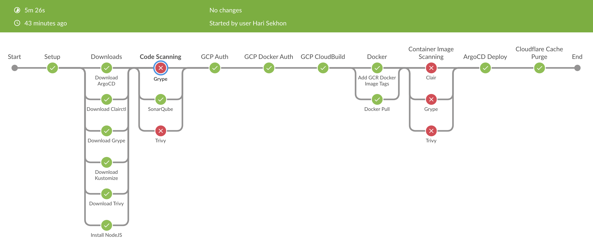

### ArgoCD - GitOps for Kubernetes

[argocd.d2](argocd.d2):


<!--  -->

### GCP Cloudflare Web Architecture GKE

A production internet customer facing website and apps replatform to Google Kubernetes Engine I did for an internet startup client using:

- GitHub repo: [nholuongut/Terraform](https://github.com/nholuongut/Terraform)
- GitHub repo: [nholuongut/kubernetes-configs](https://github.com/nholuongut/kubernetes-configs)
  - [External DNS](https://github.com/nholuongut/kubernetes-configs/tree/master/external-dns/base) automatic DNS record creation in Cloudflare for any Kubernetes ingresses
  - [External Secrets](https://github.com/nholuongut/kubernetes-configs/tree/master/external-secrets/base) pulling into Kubernetes from GCP Secret Manager

There are Cloudflare API scripts in the [nholuongut/devops-bash-tools](https://github.com/nholuongut/devops-bash-tools) repo.

[gcp_cloudflare_web_architecture_gke.py](gcp_cloudflare_web_architecture_gke.py):

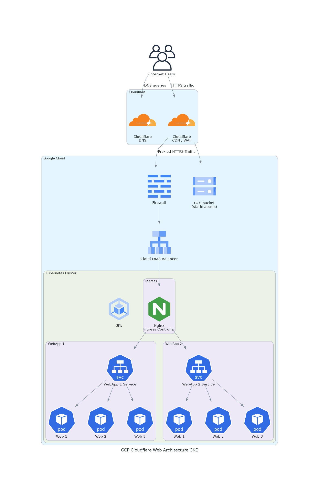

### GCP Malware Scanner with ClamAV

A variation using Kubernetes and Cloud Functions of this GCP malware scanner solution architecture:

<https://cloud.google.com/architecture/automate-malware-scanning-for-documents-uploaded-to-cloud-storage>

[gcp_malware_scanner.d2](gcp_maleware_scanner.d2):


### Kubernetes Deployment with Horizontal Pod Autoscaler and Ingress

- GitHub repo: [nholuongut/kubernetes-configs](https://github.com/nholuongut/kubernetes-configs)
  - [deployment.yaml](https://github.com/nholuongut/kubernetes-configs/blob/master/deployment.yaml)
  - [horizontal-pod-autoscaler.yaml](https://github.com/nholuongut/kubernetes-configs/blob/master/horizontal-pod-autoscaler.yaml)
  - [ingress.yaml](https://github.com/nholuongut/kubernetes-configs/blob/master/ingress.yaml)

[kubernetes_deployment_hpa_ingress.py](kubernetes_deployment_hpa_ingress.py):

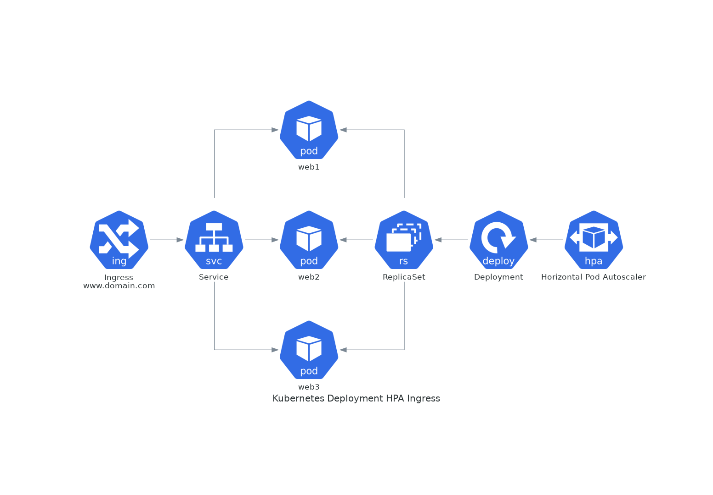

### Kubernetes Stateful Architecture with persistent volumes

- GitHub repo: [nholuongut/kubernetes-configs](https://github.com/nholuongut/kubernetes-configs)
  - [statefulset.yaml](https://github.com/nholuongut/kubernetes-configs/blob/master/statefulset.yaml)

[kubernetes_stateful_architecture.py](kubernetes_stateful_architecture.py):

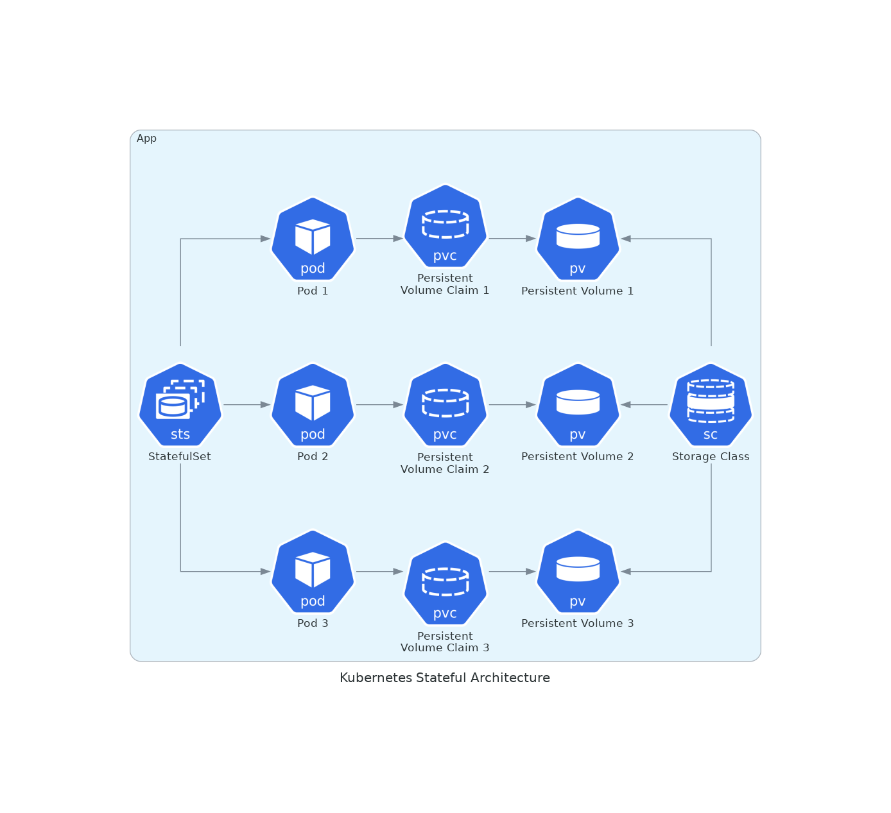

### Kubernetes Service External Traffic Policy

- GitHub repo: [nholuongut/kubernetes-configs](https://github.com/nholuongut/kubernetes-configs)
  - [service.yaml](https://github.com/nholuongut/kubernetes-configs/blob/master/service.yaml#L141)

[GKE docs](https://cloud.google.com/kubernetes-engine/docs/how-to/service-parameters#externalTrafficPolicy)

[kubernetes_external_traffic_policy.d2](kubernetes_external_traffic_policy.d2):


### Kubernetes on Premise

- GitHub repo: [Kubernetes-configs](https://github.com/nholuongut/kubernetes-configs)
- GitHub repo: [HAProxy-configs](https://github.com/nholuongut/HAProxy-configs)

Traditionally:

[kubernetes_on_premise.d2](kubernetes_on_premise.d2):


with [MetalLB](https://metallb.universe.tf/):

- GitHub repo: [nholuongut/kubernetes-configs](https://github.com/nholuongut/kubernetes-configs)
  - [MetalLB](https://github.com/nholuongut/kubernetes-configs/tree/master/metal-lb/base)

Is it just me or do MetaLB think they're [Starfleet](https://en.wikipedia.org/wiki/Starfleet)? (compare their logos)

[kubernetes_on_premise_metallb.d2](kubernetes_on_premise_metallb.d2):


### Traefik Kubernetes Ingress on GKE

A Traefik deployment I did for a client.

- GitHub repo: [nholuongut/kubernetes-configs](https://github.com/nholuongut/kubernetes-configs)
  - [Traefik](https://github.com/nholuongut/kubernetes-configs/tree/master/traefik/base)
  - [Traefik Hub Agent](https://github.com/nholuongut/kubernetes-configs/tree/master/traefik-hub-agent/base)

[kubernetes_traefik_ingress_gke.py](kubernetes_traefik_ingress_gke.py):

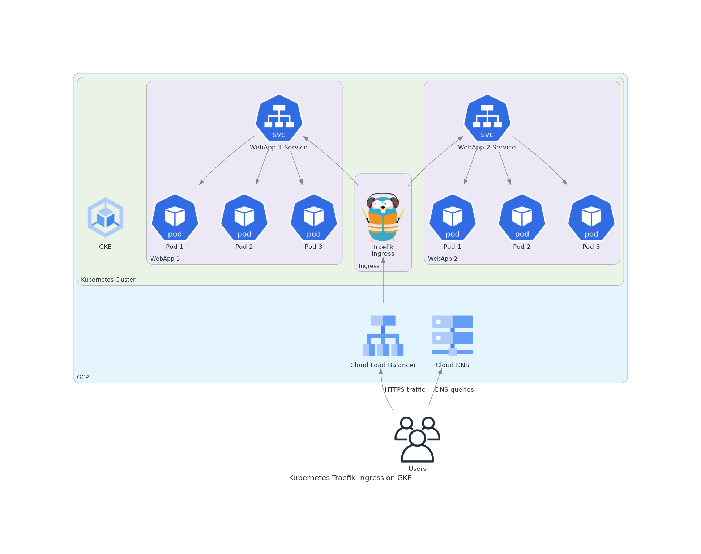

[kubernetes_traefik_ingress_gke.d2](kubernetes_traefik_ingress_gke.d2):


### Kong API Gateway on Kubernetes (AWS EKS)

A Kong API Gateway deployment I did for a client.

- GitHub repo: [nholuongut/kubernetes-configs](https://github.com/nholuongut/kubernetes-configs)
  - [Kong](https://github.com/nholuongut/kubernetes-configs/tree/master/kong/base)
  - [Cert Manager](https://github.com/nholuongut/kubernetes-configs/tree/master/cert-manager/base)
  - [ArgoCD](https://github.com/nholuongut/kubernetes-configs/tree/master/argocd/base)

[kubernetes_kong_api_gateway_eks.py](kubernetes_kong_api_gateway_eks.py):

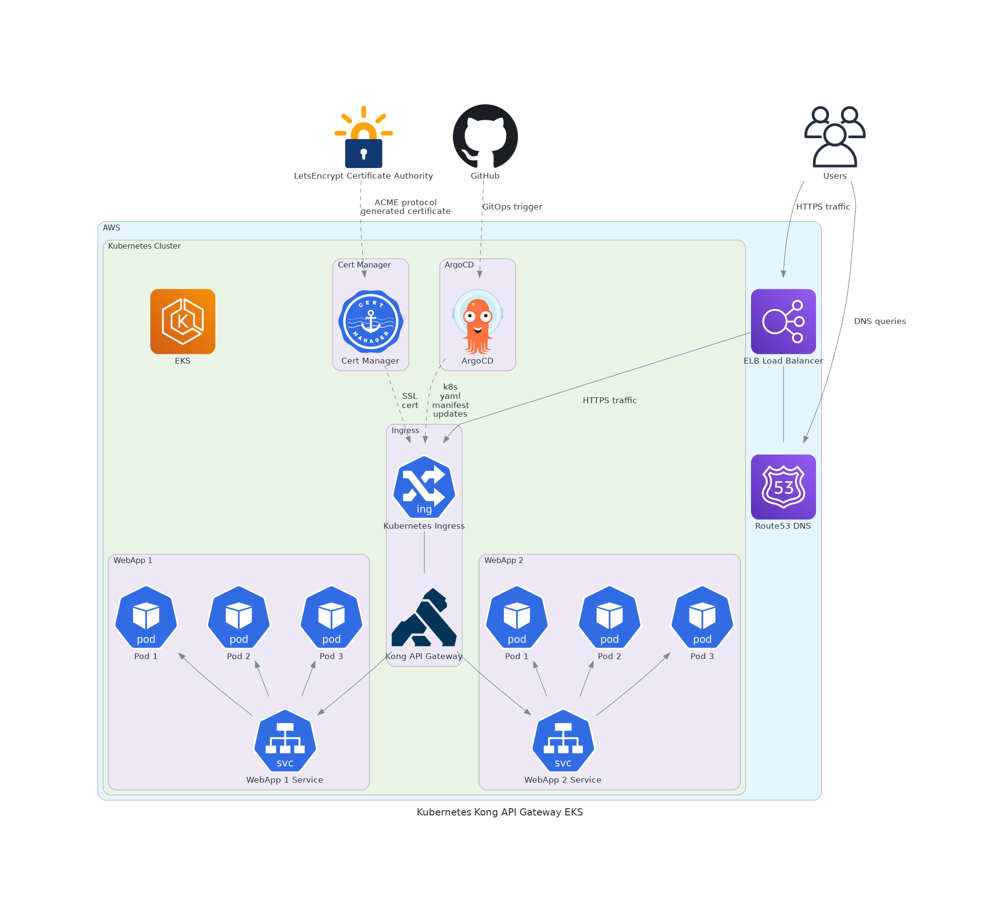

### OpenTSDB on Kubernetes and HBase

A high scale production OpenTSDB replatform I did to Kubernetes for a client, ingesting 9 billion data points per day and serving 3 million queries per day.

I also had to do advanced performance tuning of their production HBase cluster which was suffering from frequent outages at this scale due to being set up by a non-SME on the wrong hardware (I had to make do with the existing hardware of course).

This was the second client I did in-depth performance tuning of HBase for - I've published a selection of useful HBase tools - see `hbase_*.py` and `opentsdb_*.py` in [nholuongut/DevOps-Python-tools](https://github.com/nholuongut/DevOps-Python-tools).

[opentsdb_kubernetes_hbase.d2](opentsdb_kubernetes_hbase.d2):


### MySQL Replica Architecture

[mysql_replica_architecture.d2](mysql_replica_architecture.d2):


### Kafka Pub/Sub

[kafka_pubsub.d2](kafka_pubsub.d2):


### Elasticsearch Queries

[elasticsearch_queries.d2](elasticsearch_queries.d2):


### Kafka Flink Elasticsearch

[kafka_flink_elasticsearch.d2](kafka_flink_elasticsearch.d2):


### Cassandra Queries

[cassandra_queries.d2](cassandra_queries.d2):


### Prometheus & Thanos

[prometheus_thanos.d2](prometheus_thanos.d2)

See Also: Prometheus and components quick install scripts in the
[DevOps-Bash-tools](https://github.com/nholuongut/devops-bash-tools) repo.


### RabbitMQ Pub/Sub

[rabbitmq_pubsub.d2](rabbitmq_pubsub.d2):


### Apigee Akamai EKS

[apigee_akamai_eks.d2](apigee_akamai_eks.d2)


### Devs Test in Production

Iirc I created and stuck this meme pic of [The Most Interesting Man in the World](https://en.wikipedia.org/wiki/The_Most_Interesting_Man_in_the_World) on the wall of my tech dept back in 2011 while leading the infra team of an internet Ad Tech company doing several production releases a day. We literally did test in production using a small fraction of live internet traffic via canary deployments.

[test_in_production.d2](test_in_production.d2):


If done badly though without canary release testing or similar then it can result in this...

### Code, Commit, Push, Boom

[code_commit_push.d2](code_commit_push.d2):


### The Danger of Testing Ideas in Production

I may have gone overboard and done so many Diagrams-as-Code I'm starting to see life this way...

[karl_marx_test_ideas_in_production.d2](karl_marx_test_ideas_in_production.d2)


### Git - Environment Branches

At least they don't [only test in Production](https://github.com/nholuongut/diagrams-as-code/blob/master/README.md#devs-test-in-production)!

Another internet facing client refused to use tagging because they didn't want to have to think up version or release numbers for their website releases.

Not everybody likes environment branches, but they worked in production for over 2 years and they are easy to use.

Also, contrary to some naysayers it's quite easy to diff environment branches as everything should be in Git, so you can get a very quick and easy difference between your environments in a single `git diff` command. It's also easy to automate backporting hotfixes to lower environments:

- GitHub repo: [nholuongut/jenkins](https://github.com/nholuongut/Jenkin)
  - [gitMerge.groovy](https://github.com/nholuongut/jenkins/blob/master/vars/gitMerge.groovy)
  - [gitMergePipeline.groovy](https://github.com/nholuongut/jenkins/blob/master/vars/gitMergePipeline.groovy)

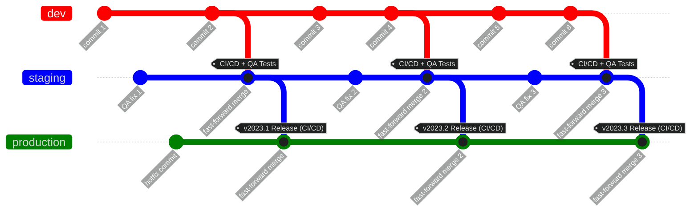
```mermaid
%%{ init: {
        "logLevel": "debug",
        "theme": "dark",
        "gitGraph": {
            "mainBranchName": "dev"
        },
        "themeVariables": {
            "git0": "red",
            "git1": "blue ",
            "git2": "green",
            "gitInv0": "#FFFFFF",
            "gitBranchLabel0": "#FFFFFF",
            "commitLabelColor": "#FFFFFF"
        }
    }
}%%

gitGraph
    branch staging
    branch production

    checkout dev
    commit id: "commit 1"

    checkout staging
    commit id: "QA fix 1 "

    checkout production
    commit id: "hotfix commit"

    checkout dev
    commit id: "commit 2"

    checkout staging
    merge dev id: "fast-forward merge" tag: "CI/CD + QA Tests"

    checkout production
    merge staging id: "fast-forward merge " tag: "v2023.1 Release (CI/CD)"


    checkout dev
    commit id: "commit 3"

    checkout staging
    commit id: "QA fix 2 "

    %% new MermaidJS comment format
    %% checkout production
    %% commit id: "commit 3  "

    checkout dev
    commit id: "commit 4"

    checkout staging
    merge dev id: "fast-forward merge 2" tag: "CI/CD + QA Tests"

    checkout production
    merge staging id: "fast-forward merge 2 " tag: "v2023.2 Release (CI/CD)"


    checkout dev
    commit id: "commit 5"

    checkout staging
    commit id: "QA fix 3 "

    %% new MermaidJS comment format
    %% checkout production
    %% commit id: "commit 5  "

    checkout dev
    commit id: "commit 6"

    checkout staging
    merge dev id: "fast-forward merge 3" tag: "CI/CD + QA Tests"

    checkout production
    merge staging id: "fast-forward merge 3 " tag: "v2023.3 Release (CI/CD)"
```

Note: I did eventually move this client to tagged releases using `YYYY.NN` release format, just incrementing `NN` which is a no brainer ([githubNextRelease.groovy](https://github.com/nholuongut/jenkins/blob/master/vars/githubNextRelease.groovy)). It turns out the developers had eventually started using releases in Jira labelled as `YYYY.NN` to track which tickets were going into which production deployment, so when I pushed for this, it made sense to them finally as not being too great an inconvenience! It's also easy to automate by creating GitHub Releases in Jenkins ([githubCreateRelease.groovy](https://github.com/nholuongut/jenkins/blob/master/vars/githubCreateRelease.groovy)).

### LucidChart - GCP Architecture

A sample architecture I did for a client for us to talk through, which was similar to what they had in mind (I won the gig).

This is the only diagram not as code (here for historical interest). I would embed the interactive live diagram but GitHub markdown doesn't allow HTML iframes so this is the png.

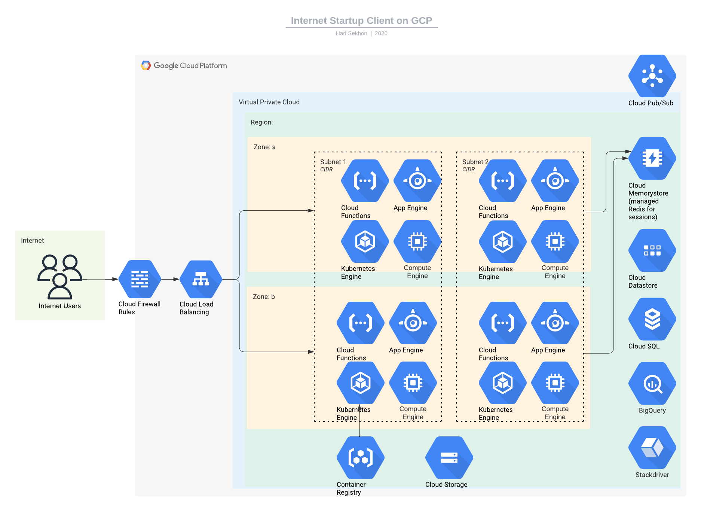

### Web Basics

When you're trying to explain to your kids how the internet works...

[web_basics.d2](web_basics.d2):


### Network - Layer 2 - Local - ARP

[network_layer2_local.d2](network_layer2_local.d2):


### Network - Layer 3 - Remote - IP

[network_layer3_remote.d2](network_layer3_remote.d2):


## Gantt Chart of my Experience

This should give you some idea of my long evolution having reached the level of lead engineer and architect
by the mid-to-late 2000s.


```mermaid
%%{ init: {
        "logLevel": "debug",
        'theme': 'dark',
        'themeVariables': {
          'activeTaskBkgColor': '#27ae60',
          'activeTaskBorderColor': 'lightgrey',
          'critBkgColor': 'blue',
          'critBorderColor': 'lightgrey',
          'doneTaskBkgColor': 'grey',
          'doneTaskBorderColor': 'lightgrey',
          'excludeBkgColor': '#eeeeee',
          'gridColor': 'lightgrey',
          'taskBkgColor': 'black',
          'taskBorderColor': 'black',
          'taskTextClickableColor': 'white',
          'taskTextColor': 'white',
          'taskTextDarkColor': 'white',
          'taskTextLightColor': 'black',
          'taskTextOutsideColor': 'white',
          'todayLineColor': 'red'
        }
    }
}%%

gantt
    title Nho Luong 's Technology Skills & Experience
    dateFormat  YYYY-MM-DD

    20+ years of Skillz to Pay the Billz : 2002-06-01, 2024-12-31

    section Operating Systems
    Linux                    : crit, 2002-12-01, 2024-12-31
    Windows Active Directory : done, 2003-01-01, 2009-11-10
    %%Redhat Linux             : active, 2002-12-01, 2024-12-31
    %%Debian Linux             : active, 2003-01-01, 2024-12-31
    %%Gentoo Linux             : done, 2004-06-01, 2009-11-10
    %%Ubuntu Linux             : active, 2006-06-01, 2024-12-31
    %%Alpine Linux             : done, 2016-01-01, 2024-12-31
    Mac                      : active, 2010-02-01, 2024-12-31

    section Coding
    Coding                 : crit, 2002-12-01, 2024-12-31
    Bash                   : active, 2002-12-01, 2024-12-31
    Python                 : active, 2005-11-01, 2024-12-31
    APIs                   : active, 2006-06-01, 2024-12-31
    %%VBScript               : done, 2005-05-01, 2009-11-01
    Perl                   : active, 2009-11-13, 2024-12-31
    Git                    : active, 2012-06-01, 2024-12-31
    %%Ruby                   : done, 2009-11-13, 2013-01-31
    Java                   : active, 2013-01-13, 2024-12-31
    %%Jython                 : done, 2013-01-13, 2015-12-31
    %%JRuby                  : done, 2013-03-01, 2013-08-31
    %%Scala                  : done, 2014-01-01, 2015-12-31
    Golang                 : active, 2015-06-01, 2024-12-31
    Groovy                 : active, 2016-01-01, 2024-12-31

    %%section Build Systems
    %%Make                   : active, 2006-06-01, 2024-12-31
    %%Maven                  : active, 2013-02-01, 2024-12-31
    %%SBT                    : active, 2014-01-01, 2024-12-31
    %%Gradle                 : active, 2014-06-01, 2024-12-31

    %%section Version Control Systems
    %%Subversion             : done, 2005-11-13, 2012-06-01
    %%Mercurial              : done, 2011-06-01, 2013-06-01
    %%Git                    : active, 2012-06-01, 2024-12-31
    %%GitHub                 : active, 2012-12-31, 2024-12-31

    section Networking
    Networking             : crit, 2004-03-01, 2024-12-31
    %%VPNs                   : active, 2006-06-01, 2024-12-31
    %%Cisco - IOS / NX-OS    : done, 2004-03-01, 2024-12-31
    %%Juniper - Netscreen / SSG / SRX / ScreenOS / JunOS : done, 2007-01-01, 2013-01-18
    %%Netgear                : done, 2005-01-01, 2012-12-31

    section Load Balancers

    section Security
    Security               : crit, 2004-10-01, 2024-12-31
    %%Kerberos               : active, 2006-06-01, 2024-12-31
    %%LDAP                   : active, 2006-06-01, 2024-12-31

    section DevOps
    DevOps                   : crit, 2005-11-11, 2024-12-31

    section Data
    Data                   : active, 2005-11-11, 2024-12-31
    %%Data Validation        : done, 2006-06-01, 2024-12-31
    %%Data Science           : done, 2013-01-18, 2024-12-31

    section Architecture
    Architecture            : crit,   2005-11-11, 2024-12-31
    Web-Scale Architecture  : active, 2009-11-01, 2024-12-31
    MicroServices           : active, 2018-10-01, 2024-12-31
    Diagrams-as-Code        : active, 2023-04-14, 2024-12-31

    section Databases (RDBMS)
    Databases (RDBMS)      : crit, 2004-01-01, 2024-12-31
    SQL                    : active, 2004-01-01, 2024-12-31
    Microsoft SQL Server   : done, 2004-01-01, 2005-10-31
    Oracle                 : done, 2005-11-01, 2009-09-10
    MySQL                  : active, 2007-01-01, 2024-12-31
    PostgreSQL             : active, 2008-01-01, 2024-12-31

    section Web & CDNs
    Web                    : crit, 2005-01-01, 2024-12-31
    APIs                   : active, 2006-06-01, 2024-12-31

    Load Balancers         : active, 2009-07-01, 2024-12-31
    %%LVS                    : done, 2009-01-01, 2009-11-11
    %%Foundry - ServerIron XL / 4G : done, 2009-10-13, 2011-11-31
    %%F5 BigIP               : done, 2010-06-01, 2013-01-18
    %%HAProxy                : active, 2018-04-01, 2024-12-31
    %%Kong                   : active, 2023-03-01, 2024-12-31
    %%Traefik                : active, 2023-03-01, 2024-12-31

    Web-Scale Architecture : active, 2009-11-01, 2024-12-31
    CDNs                   : active, 2009-12-01, 2024-12-31
    %%UlraDNS                : done, 2009-11-01, 2012-06-31
    %%Cotendo                : done, 2012-06-01, 2013-01-13
    %%Cloudflare             : active, 2020-08-20, 2024-12-31
    MicroServices            : active, 2018-10-01, 2024-12-31

    section Virtualization & Containerization
    Virtualization         : crit, 2005-01-01, 2024-12-31
    %%VMware ESX, ESXi, VirtualBox : done, 2005-01-01, 2017-02-16
    %%Vagrant                : active, 2013-01-01, 2023-12-31
    Containerization       : crit, 2014-06-01, 2024-12-31
    Docker                 : active, 2014-06-01, 2024-12-31
    Kubernetes             : active, 2018-09-01, 2024-12-31
    MicroServices          : active, 2018-10-01, 2024-12-31
    ArgoCD                 : active, 2021-01-01, 2024-12-31

    section IaaC & Configuration Management
    Configuration Management :crit, 2006-01-01, 2024-12-31
    Puppet Config Mgmt     : done, 2008-09-01, 2014-02-18
    Ansible                : active, 2014-06-01, 2024-12-31
    IaaC                   :crit, 2008-01-01, 2024-12-31
    Terraform              :active, 2019-09-01, 2024-12-31
    %%Terraform Cloud        : active, 2021-09-01, 2022-09-31
    %%Kickstart              : active, 2008-01-01, 2024-12-31
    %%Preseed                : active, 2009-01-01, 2024-12-31
    %%AutoInstall            : active, 2023-01-01, 2024-12-31

    section CI/CD
    CI/CD                  : crit, 2010-06-01, 2024-12-31
    Jenkins                : active, 2010-06-01, 2024-12-31
    Travis CI              : done, 2014-05-01, 2023-05-08
    CircleCI               : done, 2019-09-01, 2021-12-31
    BuildKite              : done, 2019-09-01, 2021-12-31
    GitHub Actions         : active, 2019-09-01, 2024-12-31
    %%GitLab                 : active, 2019-09-01, 2022-12-31
    %%Azure DevOps           : done, 2019-09-01, 2022-12-31
    %%Bitbucket              : done, 2019-09-01, 2022-12-31
    %%Concourse              : active, 2019-11-01, 2020-03-20
    %%TeamCity               : active, 2020-08-20, 2021-02-31
    CloudBuild             : active, 2020-08-20, 2023-09-30

    section Monitoring
    Monitoring             : crit, 2006-06-01, 2024-12-31
    Nagios                 : active, 2006-06-01, 2019-07-31
    OpenTSDB               : done, 2016-09-01, 2019-07-31
    Grafana                : active, 2018-01-01, 2024-12-31
    Prometheus             : active, 2018-06-01, 2024-12-31
    %%Pingdom                : done, 2020-08-20, 2023-09-17
    %%Datadog                : done, 2022-08-20, 2023-09-17

    section Big Data
    Big Data               : crit, 2009-11-13, 2019-07-31
    Hadoop                 : done, 2009-11-13, 2019-07-31
    %%HDFS                   : done, 2009-11-13, 2019-07-31
    %%MapReduce              : done, 2012-06-01, 2019-07-31
    Cloudera / Hortonworks : done, 2012-08-01, 2020-03-20
    Hive                   : done, 2013-01-18, 2019-07-31
    HBase                  : active, 2013-02-01, 2019-07-31
    Impala                 : done, 2013-04-01, 2015-06-30
    Spark                  : active, 2014-01-01, 2019-07-31
    Kafka                  : active, 2014-01-01, 2019-07-31
    Apache Drill           : active, 2014-06-01, 2018-12-31

    section NoSQL
    NoSQL                  : crit, 2009-11-13, 2024-12-31
    HBase                  : active, 2013-02-01, 2019-07-31
    %%MongoDB                : done, 2013-06-01, 2013-12-31
    Cassandra              : active, 2013-08-01, 2024-12-31
    Couchbase              : done, 2013-11-01, 2024-03-01

    section Caching
    Caching                : crit, 2009-11-31, 2024-12-31
    Memcached              : done, 2009-11-31, 2024-12-31
    Redis                  : active, 2013-03-01, 2024-12-31

    section Cloud
    Cloud            : crit, 2012-09-01, 2024-12-31
    AWS              : active, 2012-09-01, 2024-12-31
    GCP              : active, 2018-09-01, 2024-12-31
    Azure            : active, 2020-08-01, 2024-12-31

    section Search
    Search                 : crit, 2013-03-31, 2024-12-31
    Elasticsearch          : active, 2013-03-31, 2024-12-31
    %%LogStash               : done, 2013-03-31, 2024-12-31
    %%Fluentd                : crit, 2018-03-31, 2024-12-31
    %%Kibana                 : crit, 2013-03-31, 2024-12-31
    SolrCloud              : done, 2013-04-01, 2024-03-01
```

## Gantt Chart of my GitHub Repos

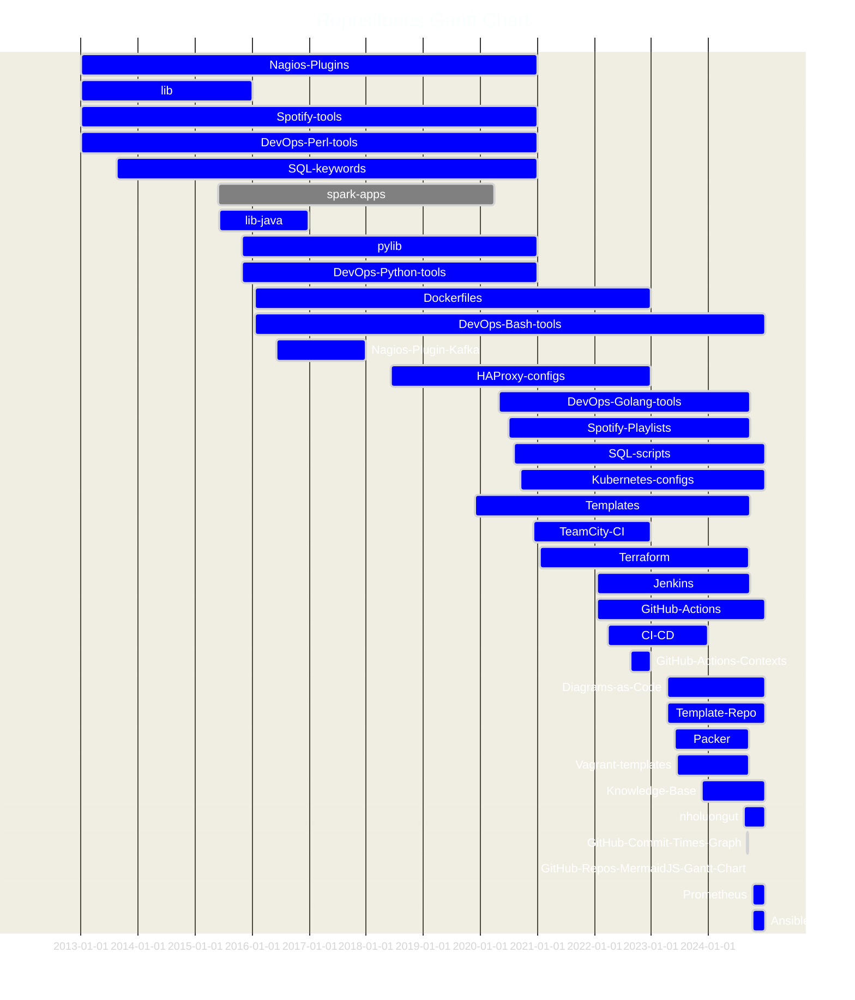
```mermaid
%%{ init: {
        "logLevel": "debug",
        'theme': 'dark',
        'themeVariables': {
          'activeTaskBkgColor': '#0000ff',
          'activeTaskBorderColor': 'lightgrey',
          'critBorderColor': 'lightgrey',
          'doneTaskBkgColor': 'grey',
          'doneTaskBorderColor': 'lightgrey',
          'taskBkgColor': 'black',
          'taskBorderColor': 'black',
          'taskTextColor': 'white',
          'taskTextDarkColor': 'white',
          'taskTextLightColor': 'black',
          'todayLineColor': 'red'
        }
    }
}%%
gantt
    dateFormat  YYYY-MM-DD
    title Repositories Gantt Chart
    Nagios-Plugins : active, 2012-12-30, 2020-12-31
    lib : active, 2012-12-30, 2015-12-31
    Spotify-tools : active, 2012-12-30, 2020-12-31
    DevOps-Perl-tools : active, 2012-12-30, 2020-12-31
    SQL-keywords : active, 2013-08-13, 2020-12-31
    spark-apps : done, 2015-05-25, 2020-04-02
    lib-java : active, 2015-05-31, 2016-12-31
    pylib : active, 2015-10-27, 2020-12-31
    DevOps-Python-tools : active, 2015-10-27, 2020-12-31
    Dockerfiles : active, 2016-01-17, 2022-12-31
    DevOps-Bash-tools : active, 2016-01-17, 2024-12-31
    Nagios-Plugin-Kafka : active, 2016-06-07, 2017-12-31
    HAProxy-configs : active, 2018-06-08, 2022-12-31
    DevOps-Golang-tools : active, 2020-04-30, 2024-09-22
    Spotify-Playlists : active, 2020-06-29, 2024-09-22
    SQL-scripts : active, 2020-08-05, 2024-12-31
    Kubernetes-configs : active, 2020-09-16, 2024-12-31
    Templates : active, 2019-11-25, 2024-09-25
    TeamCity-CI : active, 2020-12-03, 2022-12-31
    Terraform : active, 2021-01-18, 2024-09-21
    Jenkins : active, 2022-01-17, 2024-09-23
    GitHub-Actions : active, 2022-01-17, 2024-12-31
    CI-CD : active, 2022-03-25, 2023-12-31
    GitHub-Actions-Contexts : active, 2022-08-17, 2022-12-31
    Diagrams-as-Code : active, 2023-04-14, 2024-12-31
    Template-Repo : active, 2023-04-15, 2024-12-31
    Packer : active, 2023-06-02, 2024-09-21
    Vagrant-templates : active, 2023-06-12, 2024-09-21
    Knowledge-Base : active, 2023-11-22, 2024-12-31
    nholuongut : active, 2024-08-14, 2024-12-31
    GitHub-Commit-Times-Graph : active, 2024-09-07, 2024-09-08
    GitHub-Repos-MermaidJS-Gantt-Chart : active, 2024-10-02, 2024-10-03
    Prometheus : active, 2024-10-08, 2024-12-31
    Ansible : active, 2024-10-08, 2024-12-31
```

## Git Commits per Month for this Repo

Code generated by this script from [DevOps-Bash-tools](https://github.com/nholuongut/devops-bash-tools).

### GNUplot - Commits per Month

[git_graph_commit_history_gnuplot.sh](https://github.com/nholuongut/devops-bash-tools/blob/master/git/git_graph_commit_history_gnuplot.sh)

[git_commits_per_month.gnuplot](git_commits_per_month.gnuplot)

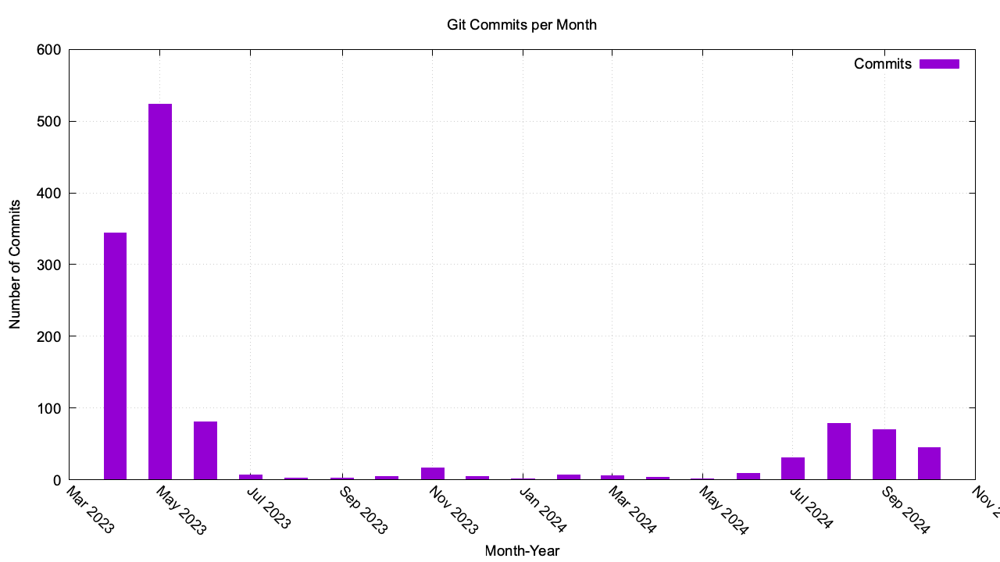

### MermaidJS - Commits per Month

[git_graph_commit_history_mermaidjs.sh](https://github.com/nholuongut/devops-bash-tools/blob/master/git/git_graph_commit_history_mermaidjs.sh)

[git_commits_per_month.mmd](git_commits_per_month.mmd)

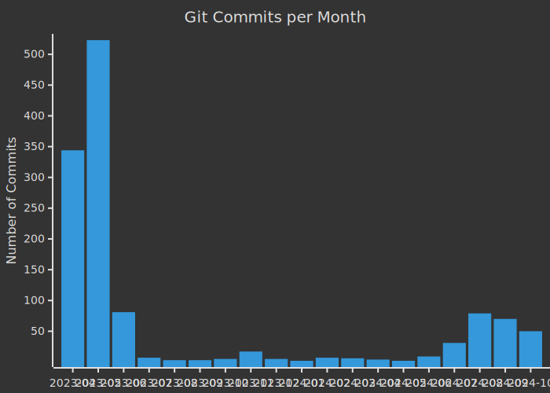

## Git Commit Times across my Repos

Code generated by this script from [DevOps-Bash-tools](https://github.com/nholuongut/devops-bash-tools).

### GNUplot - Commit Times

[github_graph_commit_times_gnuplot.sh](https://github.com/nholuongut/devops-bash-tools/blob/master/git/github_graph_commit_times_gnuplot.sh)

[git_commits_times.gnuplot](git_commit_times.gnuplot)

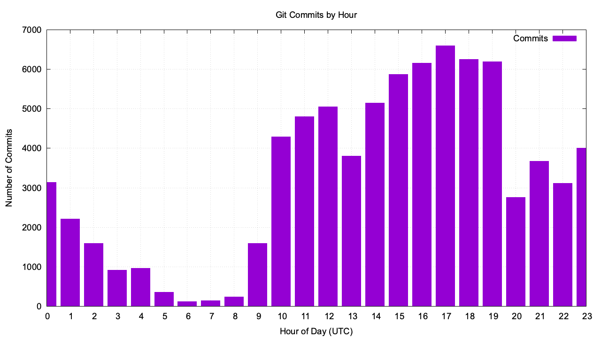

### MermaidJS - Commit Times

[github_graph_commit_times_mermaidjs.sh](https://github.com/nholuongut/devops-bash-tools/blob/master/git/github_graph_commit_times_mermaidjs.sh)

[git_commits_times.mmd](git_commit_times.mmd)

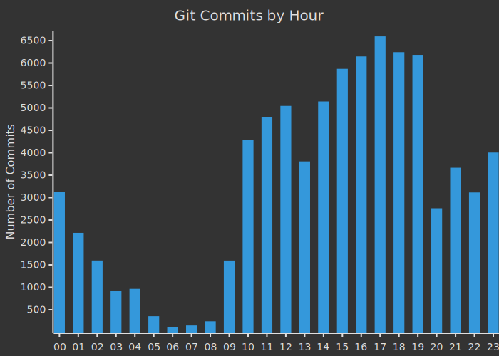

### Golang GoNum - Commit Times

Repo: [nholuongut/GitHub-Graph-Commit-Times](https://github.com/nholuongut/GitHub-Graph-Commit-Times)

Coded using [GoNum](https://www.gonum.org/):


## Samples Revamped

These are reworked from [Python diagrams](https://diagrams.mingrammer.com/docs/getting-started/examples) and [Cloudgram](https://cloudgram.dedalusone.com/examples.html) examples.

### AWS Load Balanced Web Farm

[aws_load_balanced_web_farm.py](aws_load_balanced_web_farm.py):

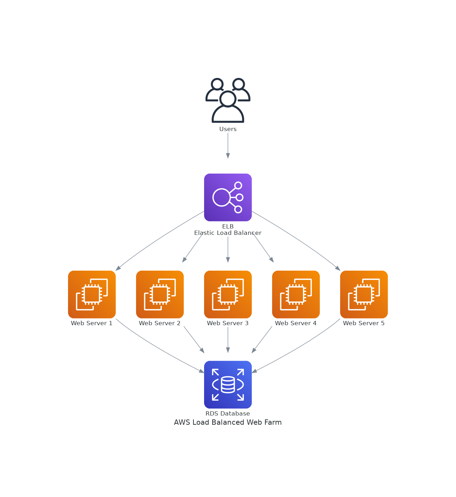

### AWS Clustered Web Services

[aws_clustered_web_services.py](aws_clustered_web_services.py):

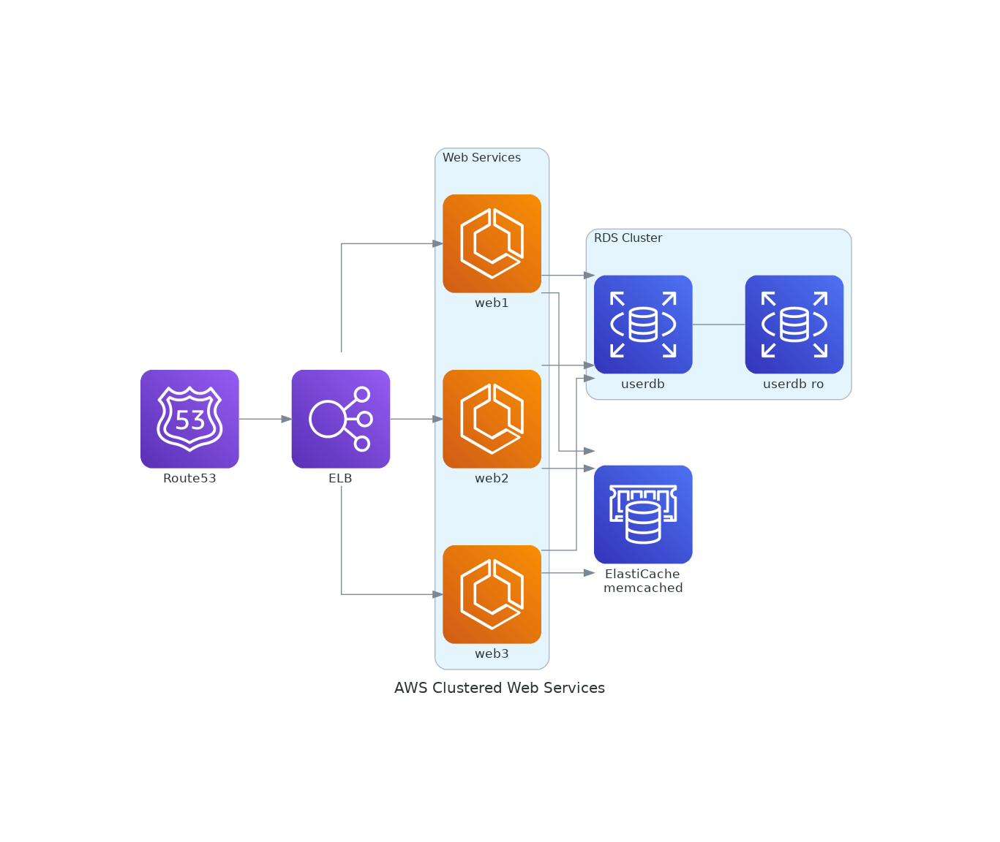

### Advanced Web Services Open Source

[advanced_web_services_open_source.py](advanced_web_services_open_source.py):

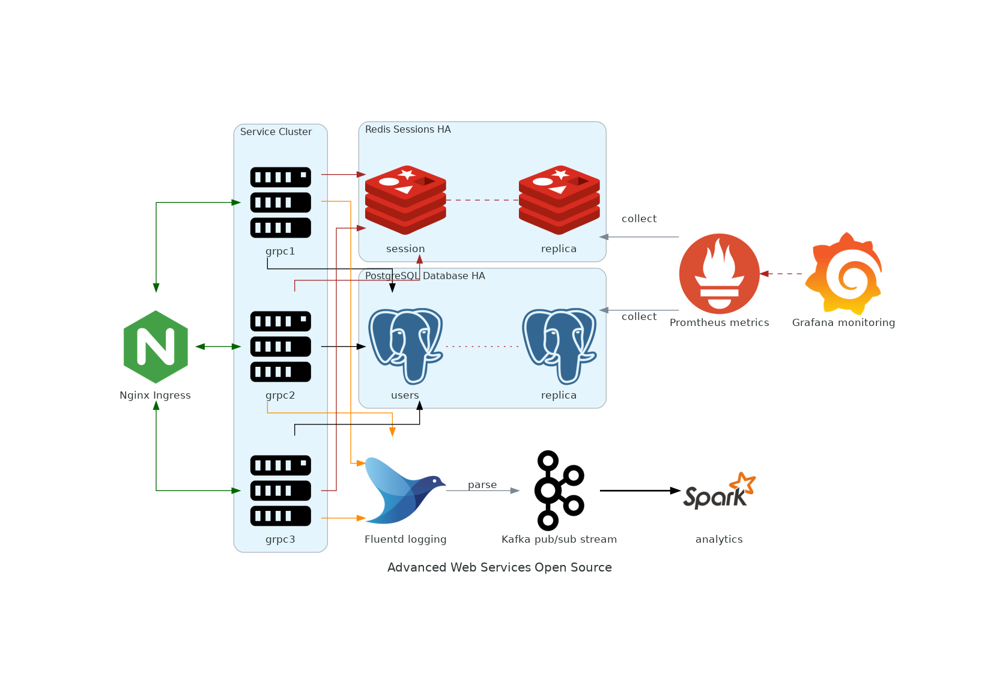

### GCP Pub/Sub Analytics

[gcp_pubsub_analytics.py](gcp_pubsub_analytics.py):

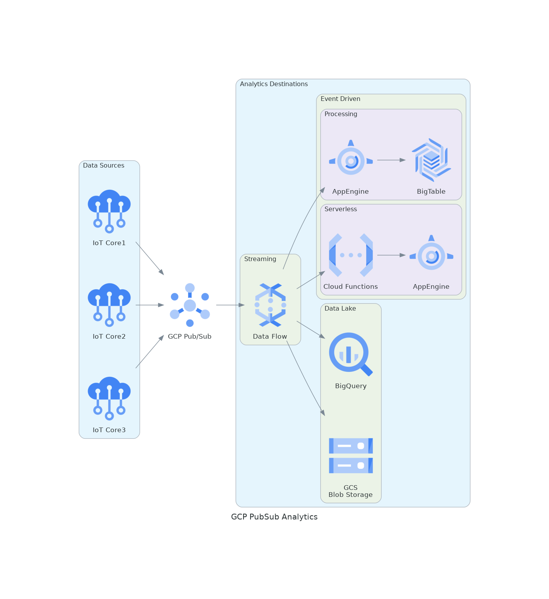

### AWS Event Processing

[aws_event_processing.py](aws_event_processing.py):

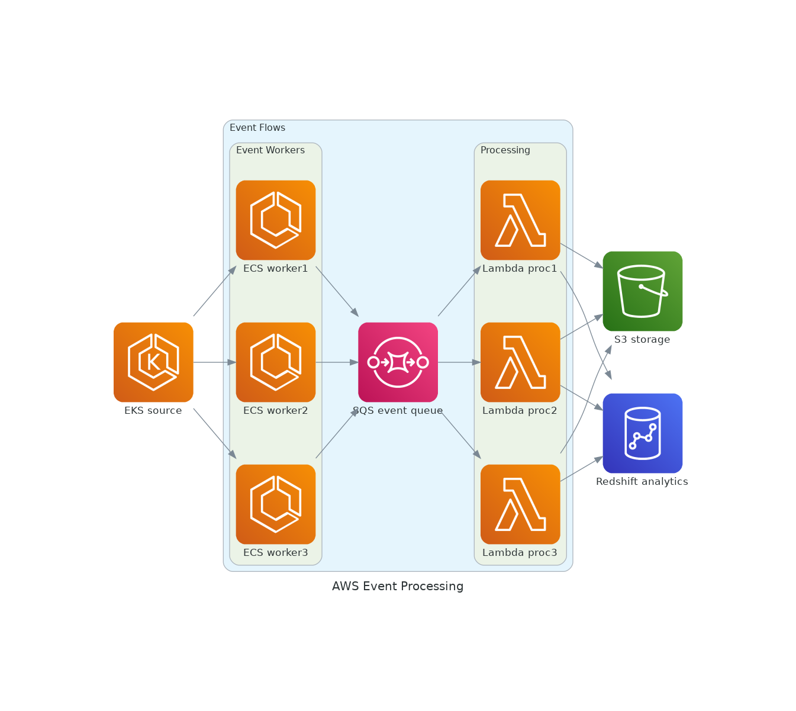

### AWS Serverless Image Processing

[aws_serverless_image_processing.py](aws_serverless_image_processing.py):

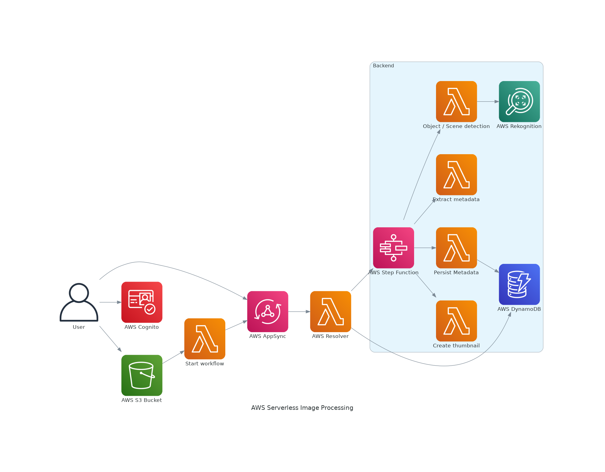

## Build from Source

Install D2, Graphviz, Python3 and 'diagrams' pip module:

```shell
git clone https://github.com/nholuongut/diagrams-as-code diagrams

cd diagrams

make install
```

Create all the `.png` and `.svg` diagrams in the `images/` dir:

```shell
make
```

Generate only the D2 svg diagrams:

```shell
make d2
```

Generate only the Python png diagrams:

```shell
make py
```

Create any single D2 diagram by running the d2 script file:

```shell
./jenkins_kubernetes_docker.d2
```

Create any single Python diagram and have it open automatically by running the python script file:

```shell
./gcp_cloudflare_web_architecture_gke.py
```

## Templates

The [templates/diagram.d2](https://github.com/nholuongut/templates/blob/master/diagram.d2) and [templates/diagram.py](https://github.com/nholuongut/templates/blob/master/diagram.py) show the basics of each language.

They are a good starting point for creating your own diagrams, and come pre-loaded with many useful icons, links to docs and links to icon sets.

# 🚀 I'm are always open to your feedback.  Please contact as bellow information:
### [Contact ]
* [Name: nho Luong]
* [Skype](luongutnho_skype)
* [Github](https://github.com/nholuongut/)
* [Linkedin](https://www.linkedin.com/in/nholuong/)
* [Email Address](luongutnho@hotmail.com)
* [PayPal.me](https://www.paypal.com/paypalme/nholuongut)


[](https://ko-fi.com/nholuong)

# License
* Nho Luong (c). All Rights Reserved.🌟